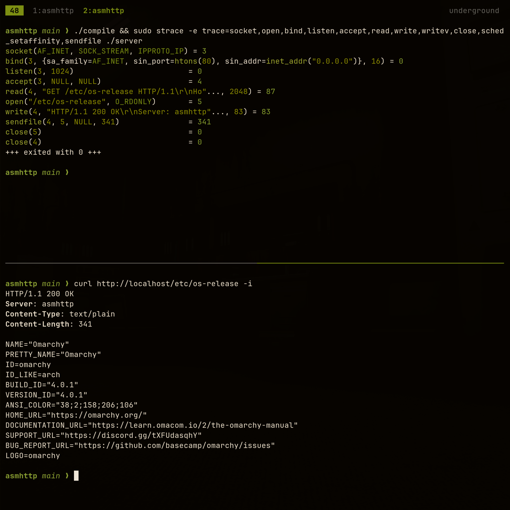

# asmhttp

A bare-metal, zero-dependency, zero-copy HTTP/1.1 server written in pure x86-64 assembly for Linux. No libc, no runtime, no bloated dependencies. Just direct syscalls and raw registers.

---

### What?

`asmhttp` is a web server engineered in pure assembly from scratch. It uses a shared-nothing, process-per-core architecture where each worker pins to a CPU core, managing incoming requests inside fixed-size ring buffers without touching the heap.

### Why?

* **For fun and discipline (I know):** In today's tech world, everything has become absurdly cushioned by layers upon layers of abstractions, package managers, and AI assistants doing the heavy lifting. This project goes back to the roots to explore what the CPU and kernel can do when nothing sits in between.
* **I'm tired of modern stack bloat:** It is ridiculous that modern backend stacks require a 500 MB+ download, hundreds of megabytes of resident RAM, and thousands of nested function calls just to listen on a TCP socket and serve a small payload. `asmhttp` proves a complete web server can live in single-digit kilobytes of memory and less.

### How?

* **100% handwritten:** Crafted instruction by instruction in GNU Assembler (`as`).
* **No AI code generation:** Built manually by reading kernel dev `man` pages (`man 2 socket`, `man 2 sendfile`, `man 2 sched_setaffinity`) and digging through System V ABI documentation just like in the good ol' days :).
* **Zero libc:** No C runtime startup code, no `printf`, and no dynamic allocators. Every syscall uses `syscall` instructions directly.

### What is the Goal?

* **Peak physical throughput:** Push requests-per-second directly to the physical limits of the network interface.
* **Minimal memory footprint:** Under 150 KB of total resident memory across all static ring buffers and state structs. All sizes are hardcoded and easy to change.
* **Near-zero disk footprint:** An executable measured in hundreds of bytes rather than megabytes. The goal is ~300 Bytes for the ENTIRE framework (`.so` / `.elf`).
* **Zero-overhead RFC security:** Strict protocol validation and exploit defense baked directly into the parser bitmasks without sacrificing clock cycles.

That is the goal for now, but zero guarantees I'll even keep it in Linux userspace. If the throughput still doesn't satisfy me, I might just scrap OS syscalls entirely and rewrite the whole thing in raw asm at the hypervisor level to talk straight to the NIC. Depends on how satisfied I am with the final benchmarks.

### What Can It Already Do? (Pre-Beta Prototype)

* **Raw socket lifecycle:** Full setup using `sys_socket`, `sys_setsockopt` (`SO_REUSEADDR`), `sys_bind`, and `sys_listen`.
* **Zero-copy HTTP parser:** Custom parser decoding verbs (`GET`, `POST`, `HEAD`, `PUT`, `DELETE`), protocol versions, paths, query strings, headers, and body directly off the wire.
* **RFC 9112 request smuggling prevention:** Strict compliance with RFC 9112 Section 6.1 by detecting and rejecting requests containing both `Transfer-Encoding: chunked` and `Content-Length` via `REQ_F_ERR_SMUGGLING`.
* **Host header injection defense:** Immediate detection and flagging of duplicate `Host` headers (`REQ_F_ERR_MULTI_HOST`) to block host spoofing and cache poisoning.
* **Path traversal detection:** Inline scanning for `../` sequences during URI parsing to flag directory traversal attempts (`REQ_F_ERR_BAD_URI`).
* **Payload and header bounds protection:** Strict enforcement of maximum header counts (`MAX_OTHER_HDRS`), body limits (`MAX_BODY_SIZE`), and bad protocol versions with instant rejection routing via `REQ_F_ERR_MASK`.
* **64-byte aligned structs:** Cache-line friendly `http_request` state blocks matched 1:1 with 2 KB wire buffers.
* **Bitmask slot allocator:** Fast, lock-free slot claiming via single-cycle bitwise instructions (`tzcnt`, `bts`, `btr`).
* **True zero-copy file serving:** Fast disk streaming using `sys_open`, `sys_fstat` for dynamic file sizing, and `sys_sendfile64` directly out of the page cache.
* **Vector responses:** Scatter-gather response header construction and streaming via `sys_writev`.
* **Core pinning:** Multi-process worker orchestration with `sys_sched_setaffinity`.

### What Is Not Yet Implemented?

* **Asynchronous `epoll` loop:** Edge-triggered (`EPOLLET`) event loops to handle thousands of concurrent idle connections per core.
* **Direct DMA / Kernel-Bypass:** Bypassing standard socket queues via `io_uring`, AF_XDP rings, or user-space packet drivers for hardware-level DMA delivery.
* **Handcrafted ELF header:** Replacing GNU `ld` output with a custom binary header crafted byte-by-byte in assembly to drop file size down to absolute physical minimums.
* **Developer DSL:** Ergonomic assembly macros for defining routes, custom middleware, and status returns cleanly.
